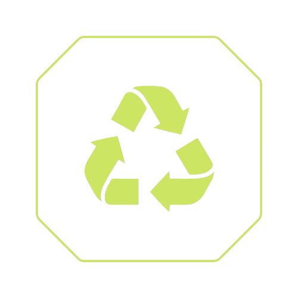

 
# e-Waste: API de Sugestão de Pontos de Coleta de Lixo Eletrônico

Visite o website: https://ewaste-api-m4.netlify.app/

A API e-Waste foi desenvolvida para gerenciar pontos de coleta de resíduos eletrônicos, facilitando o acesso e a gestão desses locais para usuários e administradores. O projeto visa contribuir para a sustentabilidade ambiental, incentivando o descarte correto de eletrônicos.

Este projeto foi desenvolvido como parte do Módulo 4 da formação FullStack do Instituto Programadores do Amanhã.

## Funcionalidades

- Listagem de Pontos de Coleta:
    - Recuperar todos os pontos de coleta cadastrados.
    - Filtrar pontos de coleta por cidade.
    - Filtrar pontos de coleta por tipo de resíduo eletrônico.

- Cadastro, Atualização e Remoção de Pontos de Coleta:
    - Adicionar um novo ponto de coleta.
    - Atualizar informações de um ponto de coleta existente.
    - Remover um ponto de coleta.

## Tecnologias Utilizadas

- Node.js
- Express
- JavaScript
- Swagger (para documentação)
- Joi (para validação de dados)
- Lowdb (para simulação de banco de dados em JSON)
- UUID (para geração de IDs únicos)

## Modelo de Dados
O modelo RecyclingPoint utilizado na API possui as seguintes propriedades:

- name: Nome do ponto de coleta.
- city: Cidade onde o ponto de coleta está localizado.
- type: Tipo de resíduo eletrônico que o ponto de coleta aceita (por exemplo, baterias, computadores, celulares, televisores).
- street_address: Endereço físico do ponto de coleta.
- contact: Informações de contato para o ponto de coleta (telefone).

## Configuração do Projeto

### Pré-requisitos

- Node.js instalado
- npm (Node Package Manager) ou yarn

### Instalação

1. Clone o repositório

    ```bash
   git clone https://github.com/ste-coding/miniprojeto-api-M4.git

2. Instale as dependências

    ```bash
    npm install

3. Para iniciar o servidor de desenvolvimento, use:
    ```bash
    npm run dev


### Documentação Swagger
O Swagger foi configurado automaticamente a partir dos endpoints definidos no arquivo ewasteRoutes.js. Para visualizar a configuração completa, consulte o arquivo swaggerConfig.js.

Documentação também acessível em: https://swagger-documentation-ewaste.netlify.app/

## Estrutura do Projeto

**src/index.js**: O ponto de entrada da aplicação. Este arquivo configura e inicia o servidor Express.

**src/routes/recyclingPoints.routes.js**: Define as rotas da API relacionadas aos pontos de coleta de resíduos eletrônicos, incluindo rotas para listar, adicionar, filtrar e remover pontos de coleta.

**src/controllers/recyclingPoints.controller.js**: Contém a lógica para manipulação das requisições da API. Cada função corresponde a uma rota e define o que acontece quando a rota é acessada.

**src/models/recyclingPoints.model.js**: Define a estrutura dos dados dos pontos de coleta. Utiliza uma classe para representar os pontos de coleta e métodos para manipulação desses dados.

**src/db.json**: Arquivo de banco de dados simulado, onde os dados dos pontos de coleta são armazenados localmente em formato JSON, por meio do lowdb.

**assets/**: Contém arquivo css e imagens usadas na landing page de apresentação do projeto

**index.html**: Arquivo base da landing page
